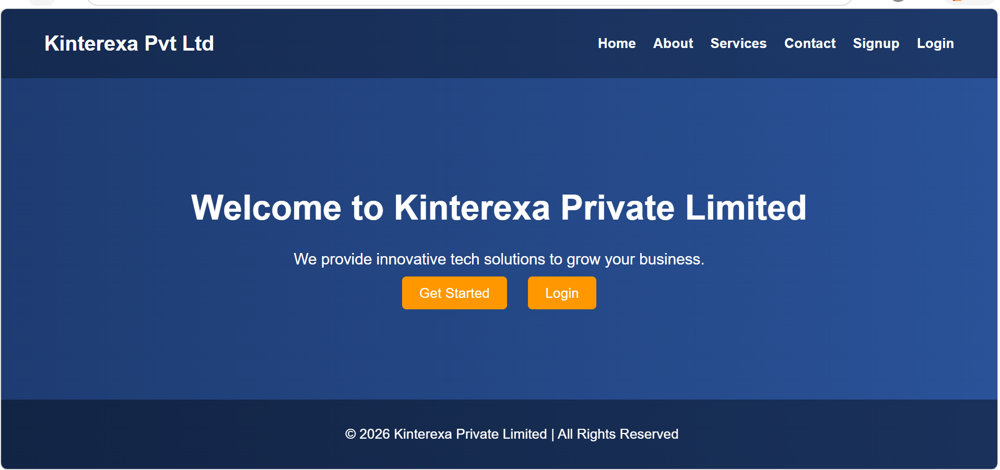

# 🚀 Kinterexa Private Limited - Flask Web App

A simple web application built using **Flask** with user authentication (Signup & Login) and a modern UI.

---

## 📌 Features

- ✅ User Signup
- ✅ User Login
- ✅ MySQL Database Integration
- ✅ Responsive UI (HTML + CSS)
- ✅ Navbar with Services Dropdown
- ✅ Animated Forms (Login & Signup)

---

## 🛠️ Tech Stack

- **Backend:** Flask (Python)
- **Frontend:** HTML, CSS
- **Database:** MySQL
- **Templating:** Jinja2

---

## 📂 Project Structure
project/
│
├── app.py
├── templates/
│ ├── home.html
│ ├── login.html
│ └── signup.html
│
├── static/
│ └── style.css
│
└── README.md


---

## ⚙️ Installation & Setup

### 1️⃣ Clone the repository
```bash
git clone https://github.com/mohdsuhel5712/flask_template_login_system.git
cd project

- Add your **mohd suhail**
- Update DB name if needed

---

If you want, I can also:
- Create a **https://github.com/mohdsuhel5712/flask_template_login_system.git**
- Add **screenshots section 📸**

- Help you **deploy this project online**

Just tell me 👍